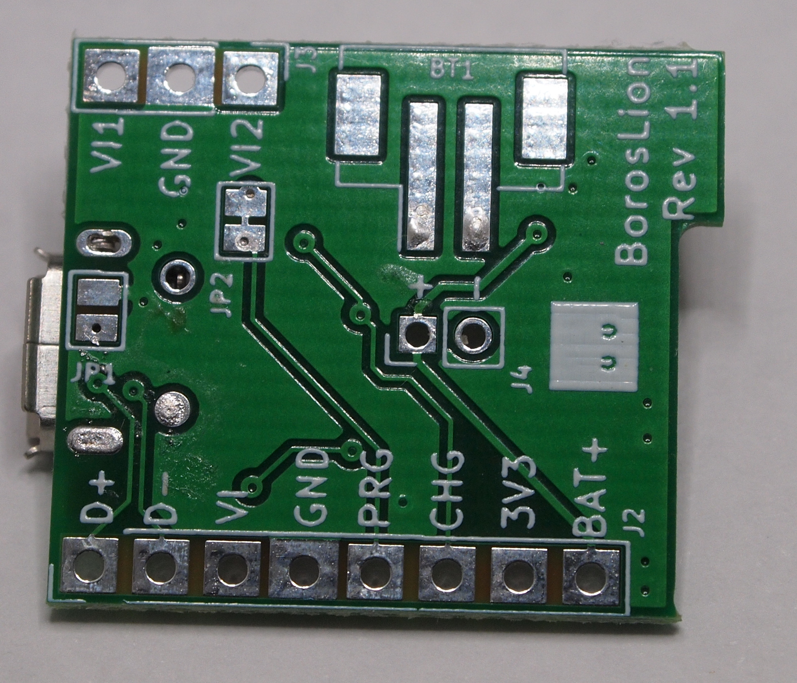
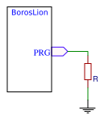
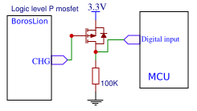
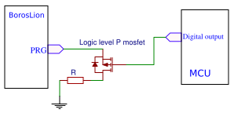
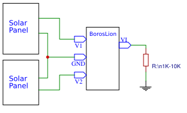

# BorosLion- A compact & low-power 3.3V power module for singe cell Li-on/Li-Po battery

## Why?

Typical maker/DIY projects for sensors or portable devices require battery operation but popular development boards offer poor features:

- High current power consumptions unsuitable for battery applications.
- Need of external module/s with a charger and/or battery protection.
- No or Limited monitoring or modify charger behavior.

__BorosLion__ helps maker to avoid ugly hacks on typical development boards and simply the power management for the project. Makers can focus on the application using a single module for power management.

## Features

__BorosLion__ brings a low-cost solution with the following features:

- Compact: sub square inch board (21mmx24mm) slim (0.8mm) board.
- 500mA or 250mA 3.3V regulated output. 
- Compliant Constant current(CC)/Constant Voltage(CV) Li-on/Po 600mA charger with integrated led.
- Low-power: 4uA Supply current(Iq) for 250mA version / 6uA Supply current for 500mA version.
- LiPo/on battery protection suitable for cheaper unprotected batteries.
- Suitable for using 5V/6V Solar panels (ready for 2 panels).
- Wall-to-battery & and Battery-to-wall glitch-less operation.
- Flexible & versatile:
   - Breadboard compatible.
   - Soldering: Can be soldered via 2.45 pin-headers or as surface mount module.
   - Three battery inputs: Wire, 2mm JST horizontal(front side) or 2mm JST vertical(back-side).
   - USB 2.0 support: Data lines are borken-out & Jumper for ID line.
   - Configurable charge current (100mA to 600mA) using a single external resistor.
   - Battery voltage is broken-out so baterry can be monitored.
   - Charging status is broken-out so as open collector output.
   - Charging current can be monitored via analog output.
   - Charger can be disabled externally using a external transistor.

## Pinout

| Label | Description | Notes |
| ----- | ----------- | ----- |
|  __Input Power lines__ |||
| +    | Postive  battery pole      | Caution: no reverse polarity protection   |
| -    | Negative battery pole      | Caution: no reverse polarity protection   |
| BT2  | Horizontal JST 2.0 front   | Pin 1: + / Pin 2: - |
| BT1  | Vertical JST 2.0 back      | Pin 1: + / Pin 2: - |
| V1   |  Diode Protected voltage inpunt 1  | V1&V2 are suitable for 6V solar panels |
| V2   |  Diode Protected voltage input 1   | |
| GND  |  Common Ground					| |
|  __Output Lines__  |||
|  D+  | USB D+  | No current limit or ESD protection |
|  D-  | USB D- | No current limit or ESD protection |
|  VI  |  Input Voltage  | |
|  PRG   |  Charger programming pin | See application notes |
|  CHG |  Charger indicator | See application notes |
|   3V3  | 3.3V regulated output ||
|   BAT+ |  Positive pole of batery | See application notes |



## Key parameters

Al test are perfomed with a regular room temperature of 20-25C. With standard LiPo Battery (900mah capacity). All figures bellow are measured typical values.

| Parameter                       | Value | Unit  | Notes               |
| ------------------------------- | ----- | ----- | ------------------- |
| Max Vin USB                     |  6    |  V    |  No reverse polarity or ESD protection |
| Max Vin (VI1 & VI2)             |  6.5  |  V    |  Diode protected |
| __Supply Current -> Iq__ | | | |
| Iq (no load) - 250mA version - |  4.5   |  uA   | Vin Disconnected    |
|  Iq (no load) - 500mA version - | 6.5 | uA | Vin Disconnected |
| Iq (no load)     |  450   |  uA   | Vin Connected Vin=5V & not charging battery|
| __Charger__  | | ||
| Min charging voltage |  4.3  | V | |
| Default charge current | 100 | mA ||
| Max charge current | 600 |  mA | See application notes |
| __Battery protection__ ||||
| Overcharge Voltage Dection | 4.30 | V | Detection time 130ms |
| Overcharge Voltage Release | 4.10 | V |  |
| Overdischarge Voltage Detection | 2.40 | V | Detection time 40ms |
| Overdischarge Voltage Release | 3.0 | V | |
| Overcurrent protection | 3 | A | Dection for more than 20ms |
| Short circuit protection | 20 | A | Detection time 75 us |
| Thermal shutdown | 100-120 | C ||
| __3V3 Regulated output__ 250mA version  ||||
| Max current continous (Vin=5V) | 250 | mA | Thermal limit |
| Max current continous (Vin=0/ Vbat=3.7V) | 130 |  mA | If the application allow some voltage drops the current output will be higher. |
| __3V3 Regulated output__ 500mA version  ||||
| Max current continous (Vin=5V) | 500 | mA | Thermal limit |
| Max current continous (Vin=0/ Vbat=3.7V) | 260 |  mA | If the application allow some voltage drops the current output will be higher. |

Notes:

- Supply current(Iq) parameter can be affected by ambient temperature.

- If the battery used has built-in protection the supply current will be increased as the the protection will use some current(typically in the range of few uA).

- Using additional decoupling capacitors in 3.3V rail is advised to avoid voltage drops for peak currents.

  

## Schematic

Check the [PDF](schematic1V1.pdf) file with full schematic

## Application notes

### Programming charging current (>100mA)
Charging current during constant current phase can be configured wiring a single resistor to ```PRG``` pin.




 Notional values for external resistor are compiled in the following table:
| R  | Constant current charge current mA (aprox) |
| -----------  | -------------------------------------- |
| No resitor   | 100mA |
|  100K        | 110mA |
|  47K         | 120mA |
|  22K         | 145mA |
|  10K         | 200mA |
|  6K8         | 250mA |
|  5K1         | 295mA |
|  4K7         | 310mA |
|  3K3         | 400mA |
|  2K2         | 550mA |
|  2K          | 600mA |

Charging currents  *600mA* is the absolute maximum of the charger IC. It is recommended to operate below this limit.

### Programming charging current under 100mA
In certain scenarios currents under 100mA are required. For example, if the battery is tiny and/or have very low C charge rating or when using small solar panels, high currents could damage the battery or make the input voltage collapse. In this special cases, the module can be modified simply by cutting (with a knife cutter) the exiting trace on jumper __JP2__. This will allow to connect a high value resistor to the ```PRG``` pin to reduce the charge current. The following table show notional values for external resistor:

|   R    | Max charge current |
| -----  | ------------------ |
|  12K	 |  83mA  |
|  15K   |  67mA  |
|  22K   |  45mA  |
|  33K   |  30mA  |
|  47K   |  21mA  |
|  51K   |  20mA  |
|  68K   |  15mA  |
| 100K   |  10mA  |
| 220K   |  5mA   |

For example, a small solar panel with max current output of 80mA for charging a 100mAh tiny LiPo cell will require a 15K resistor. This will charge the battery in less than 2h providing with margin of current capabilities of the solar panels.


As general rule the charging current can be calculated with this formula:

> IBAT= (1/R)*1000 mA
>
> where R is the total Resistance to ground in Kohms
>
> or
>
> R=(1/I)*1000 Kohm 
>
> where I is the desired current in mA.


### Monitoring charger status

Charging status can be monitored using the ```CHG``` pin. If the charger is active the voltage level of this pin is 0V (GND) , on the other hand, if the charger is not charging the battery the output of this pin will be ```VIN-Vfor``` (where Vfor is the led voltage drop).  A GPIO input of a mcu or logic circuit could be used to monitor the charger status. If the mcu or logic circuit do not tolerate ```VIN-Vfor``` voltage levels the user is responsible to implement this protection.


The following circuit is a example this level shifting using a P-mosfet:




### Monitoring charging current

The charger has three charging modes:

- Trickle charge: If battery Voltage is under 3V the charger will charge the battery at low current until the voltage is >3V. 

- Constant Voltage: The charger will try to charge at a the programed current until the charger detects that battery has reached a adequate voltage. The charger

- Constant Current: In the last phase the charger will charge at constant voltage and the charge current will start to decrease until the point the charger shutdown charge procedure.


The actual charging current can be monitored measuring the voltage of the ```PRG``` pin. The voltage range of this pin is 0-1V and should be interpreted with the following formula:


> Icharge =  (V/Rprog) * 1000 mA
>
> where V is the measured voltage in Volts.


> __Caveat__: Measure this pin require high impedance measurements to avoid altering the charge current. 


### Shutdown charger

Applications can enable or disable the charger on demand. This can be accomplished by disconnecting the pin ```PRG``` from ground. To accomplish this the line in ```JP2``` should be removed and a external circuit must control when the charger is enabled. If the ```PRG``` is disconnected from ```GND``` the charger enter in shutdown mode. On the other hand, if the charger is connected to ground via valid resistor value the charger will be enabled and with maximum current defined by the value of the pull-down resistor.

A typical circuit to control charger from the a mcu using a P mosftet:




###  Connection of solar panels

V1 & V2 are suitable for connecting directly up to two small solar panels (5V or 6V) in paralel. The board has reverse polarity protection using Schottky diodes. This will produce a small voltage drop but will protect the circuit flow between the solar panels if the voltage is not balanced. Please check that the output voltage of the solar panel is is not over 6.5V.

The recommended setup is the following:



As solar panel with light load(for example a deep sleep) can show voltages that can no be sustained when more load is required. This can cause a charge on-off cycle that could shorten the battery life. Therefore, is recommended to provide a small load to the solar panels to force to collapse in situations where the main application is in deep-sleep. A simple resistor in ```VI``` line will do the job.


### USB data connection

The module breaks out two data lines of the USB ports in the pins D+ & D-. ```ID``` Line of the USB port is floting but the user can use the  jumper ```JP1``` to short this line to ground for USB-OTG applications.

Note: the board do not provide any protection or termination resistors in this lines. If needed they should be provided in the application

# Known issues

In revision 1 with high loads the wall-to-battery operation will produce a short glitch in the regulator output.


# Future Improvements

Some users have reported the following improvements:

1. Better solder mask on breakout pins.
2. Invert battery connector to more used Pin 1 as negative pole.
3. Enable some jumpers to disable battery protection for optimizing supply current with protected batteries.
4. Break out a power line to use Bust converter Module.

This issues will be considered for future versions.


## Change log

- Rev 1     First version.
- Rev 1.1  Improve wall-to-battery switching using voltage supervisor.


